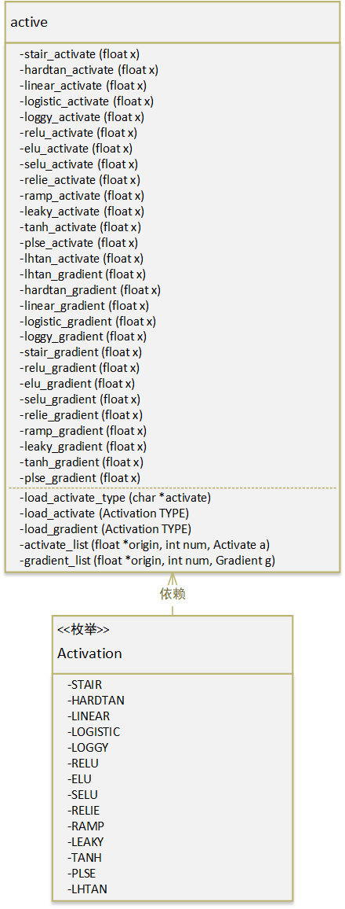

# OPS

ops(operations 算子)模块包括所有基础计算模块，无论是简单的加减还是复杂的数字图像处理，这些单纯的数值计算算法都在该模块下实现。Layer模块对该模块强依赖，Layer模块依赖各类算子实现不同的计算图过程。

ops模块包含如下子类（在C语言中通常将一个文件视为一个类）：

| 名     | 描述               |
| ------ | ------------------ |
| active | 激活函数           |
| bias   | 偏执项计算         |
| cpu    | Host侧数组相关计算 |
| gemm   | 矩阵乘             |
| im2col | im2col算法         |
| image  | 数字图像处理       |

下面将对各子类进行详细说明


## active

该类实现所有激活函数以及各函数的梯度计算，包含如下函数：

| 激活函数          | 激活函数梯度计算  |
| ----------------- | ----------------- |
| stair_activate    | stair_gradient    |
| hardtan_activate  | hardtan_gradient  |
| linear_activate   | linear_gradient   |
| logistic_activate | logistic_gradient |
| loggy_activate    | loggy_gradient    |
| relu_activate     | relu_gradient     |
| elu_activate      | elu_gradient      |
| selu_activate     | selu_gradient     |
| relie_activate    | relie_gradient    |
| ramp_activate     | ramp_gradient     |
| leaky_activate    | leaky_gradient    |
| tanh_activate     | tanh_gradient     |
| plse_activate     | plse_gradient     |
| lhtan_activate    | lhtan_gradient    |

我们采用枚举类型枚举出所有激活函数，并使用它来表示您采用的激活类型：

| enum     |
| -------- |
| STAIR    |
| HARDTAN  |
| LINEAR   |
| LOGISTIC |
| LOGGY    |
| RELU     |
| ELU      |
| SELU     |
| RELIE    |
| RAMP     |
| LEAKY    |
| TANH     |
| PLSE     |
| LHTAN    |

该类的类图如下：



通常我们使用字符串来表明所希望选择的激活函数类型，*load_activate_type*函数提供了该功能

```c
Activation load_activate_type(char *activate);
```

该函数通过输入的字符串获取对应的激活函数类型，例如：

```c
active_type = load_activate_type("logistic");
```

则*active_type*为LOGISTIC

但是最终我们希望获取到对于的激活函数或梯度计算函数，而*load_activate*与*load_gradient*提供该功能：

```c
Activate load_activate(Activation TYPE);
```

```c
Gradient load_gradient(Activation TYPE);
```

只需提供正确的激活函数类型，则会返回对应激活函数或梯度计算函数对象

最终这些激活函数或梯度计算函数将用于处理连续存储空间的数据（数组），为了方便我们提供了相关的功能函数*activate_list*与*gradient_list*

```c
void activate_list(float *origin, int num, Activate a);
```

```c
void gradient_list(float *origin, int num, Gradient g);
```

- origin：需要处理的线性空间
- num：线性空间中存放的数据数量
- a/g：激活/梯度计算函数

示例：

```c
float a[10] = {-5, -4, -3, -2, -1, 1, 2, 3, 4, 5};
Activation type = load_activate_type("relu");
Activate active = load_activate(type);
activate_list(a, 10, active);
```

最终数组a的值为：

```
0, 0, 0, 0, 0, 1, 2, 3, 4, 5
```